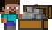

  
  <h1 style="vertical-align: middle">Manoel Nogueira</h1> 

## Languages ​​and Technologies

  
 
    
    
    
    
    
    
    
    
    
    
    <h1></h1>
  

  
  
  
  
  

<h2>
  
   
</h2>

<h4>
  
   
</h4>

  
  
  
  
  
  
  
  
  

<h4>
  
   
</h4>

  

<h4>
  
   
</h4>

  
  
  
  

<!-- 
  <h2>
    
     
  </h2>
-->

## Connect with me
  
  
  
  

<!-- 
  
 
    
  

-->

---

  
  

---

---

